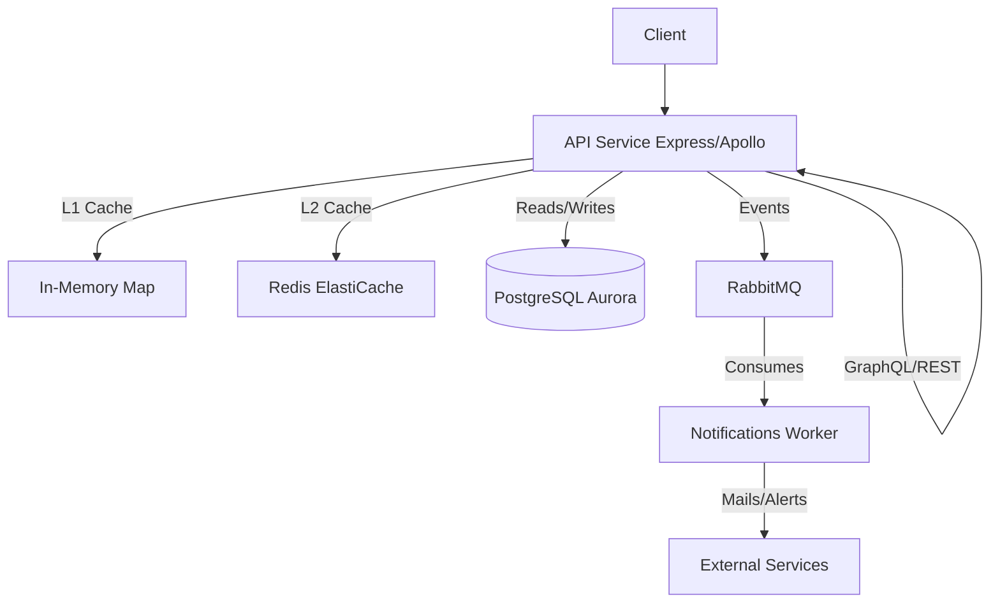

# Native Node API Microservices

An advanced Node.js project showcasing modern backend architecture, featuring a sophisticated REST API, GraphQL, Prisma ORM, RabbitMQ messaging, and multi-layer caching with Redis.

## Architecture



## Features

- **TypeScript Configuration:** Advanced ES2022 setup with `NodeNext` module resolution.
- **Microservices:** Separation of concerns between API and Notification services.
- **REST & GraphQL:** Utilizing Express and Apollo Server.
- **ORM:** Prisma Client with advanced PostgreSQL connection pooling.
- **Messaging:** RabbitMQ integration for asynchronous event-driven architecture.
- **Advanced Node.js:** Worker Threads for heavy computations, offloading the event loop. Native fetch for external API calls.
- **Multi-layer Caching:** Implements an L1 (in-memory) and L2 (Redis) caching strategy.
- **Testing:** Comprehensive Jest suite utilizing ESM modules.
- **Infrastructure:** Docker Compose for local development. AWS CloudFormation templates provided for ECS/Fargate deployment. CI/CD configured with GitHub actions.

## Quick Start (Local Setup)

1. **Install dependencies:**
   ```bash
   npm install
   ```

2. **Start Infrastructure:**
   Ensure Docker is running, then execute:
   ```bash
   docker-compose up -d
   ```

3. **Generate Prisma Client:**
   ```bash
   npx prisma generate
   ```

4. **Run Services:**
   *API Service:*
   ```bash
   npm run dev:api
   ```
   *Notifications Worker:*
   ```bash
   npm run dev:notifications
   ```

## Endpoints

- **REST:**
  - `GET /api/users`
  - `POST /api/users`
  - `GET /api/external-data-computation` (Tests Node.js Worker Threads)
- **GraphQL:**
  - `http://localhost:3000/graphql`

## Testing

Run unit and integration tests using Jest:

```bash
npm test
```
